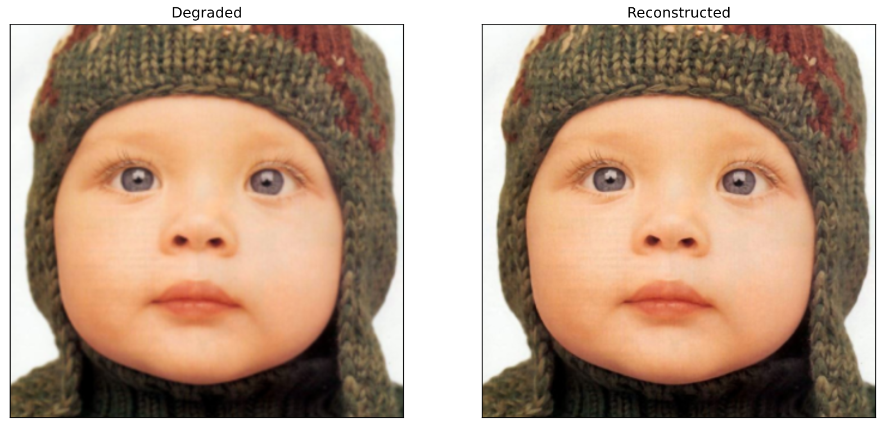

[](https://forthebadge.com)

# CNN for Image Restoration
This repository is demonstration of Image quality restoration using a pre-trained SRCNN model on Tensorflow 2.X based on the paper [Image Super-Resolution Using Deep Convolutional Networks](https://arxiv.org/abs/1501.00092v3))





## Requirements 
```
Tensorflow 2.X
Scikit-image
OpenCV
Numpy
Matplotlib
```

 